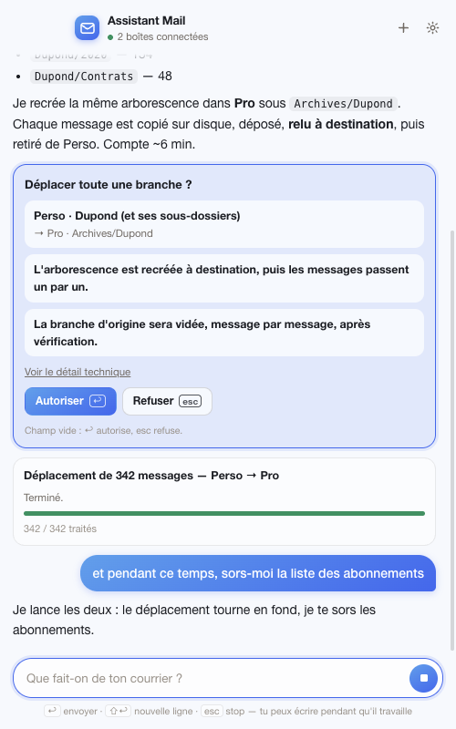
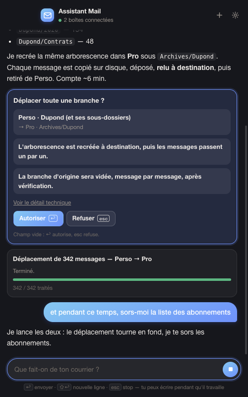

# Assistant Mail

A small macOS app that opens a conversational assistant — a Claude Code agent dressed up as a window — connected over **IMAP and SMTP** to your real mailboxes.

Think of it as "Claude Code started in a folder", where the folder is your mail: the same capabilities (Bash, files, web) plus about twenty tools that talk to mail servers. You chat, it does the work.

> *File the Dupond folder by year · How many newsletter subscriptions do I have? · Delete the job-alert emails from my inbox · Move the whole history from Personal to Work under Archives/Dupond*

> The UI is in French.

## Screenshots

*The screenshots replay a scripted demo conversation (`scripts/apercu.mjs`) with fictional mailboxes — no real account or message.*

| Light | Dark |
| --- | --- |
|  |  |

## Install

```bash
npm install
npm run install-app      # builds the app, installs it in /Applications and pins it to the Dock
```

**Claude** does the processing with the account already signed in on the machine: the app uses the Claude Agent SDK, which reuses Claude Code's credentials (`claude /login` in a terminal), or `ANTHROPIC_API_KEY` as a fallback. The model is chosen in the ⚙ settings (Opus 5 by default).

One click opens it, the close button hides it (it stays in the Dock), `⌘Q` quits.

| Shortcut | Action |
|---|---|
| `↩` | send |
| `⇧↩` | new line |
| `esc` | decline the pending card, otherwise interrupt the agent |
| `⌘.` | interrupt the agent |
| `⌘N` | new conversation |

On launch the assistant **resumes the previous conversation**; `+` starts over.

## Adding a mailbox

Settings ⚙ → address + password → **Détecter et connecter**. The app looks up the servers (known providers, Thunderbird autoconfig database, educated guesses), **actually tests the connection**, then saves it. Manual settings remain available.

- Gmail, Yahoo and iCloud require an **app password**, not the account password.
- Passwords are encrypted with AES-256-GCM in the app data folder, with a `0600` key file. **They never go through the conversation**: the assistant only sees mailbox names and never asks for a password.
- Removing a mailbox from the app doesn't touch the server.

## Guarantees on production mailboxes

Every move goes through a **journaled queue**, processed **one message at a time** — never in bulk. For each message:

1. the raw message is written to disk (the **vault**);
2. it is stored at the destination — `APPEND` across accounts, server-side `MOVE` within one;
3. it is **re-read at the destination**, by UID then by `Message-ID`;
4. **only then** is it removed from the source, one UID at a time;
5. the journal is rewritten to disk.

Consequences, checked by `npm test` (35 assertions against a simulated IMAP server):

- a message that doesn't reach its destination **stays intact at the source** and processing continues;
- an interruption at message 412 of 900 **resumes** where it stopped, without duplicates;
- "delete" means **move to Trash**; permanent deletion needs an explicit word *and* a list of UIDs the assistant showed you;
- on a server without `UID EXPUNGE`, if the folder already contains messages flagged as deleted, processing is **refused** rather than risking purging them;
- a non-empty folder is never deleted unless you said so.

Logs and raw copies: **Conversation → Ouvrir le coffre et les journaux**.

## Talking while it works

The input is **never blocked**. A message typed while the agent works joins its input queue; the SDK hands it over at the next step and the agent **re-plans with it**. Long jobs hand control back after **15 seconds** and **continue in the background**, with a progress card and a *Stop* button (work done is kept, the queue can be resumed). The assistant announces when it's done.

## What needs confirmation

The decision is taken **after** the queue is prepared, so the card shows an exact count.

| Action | Confirmation |
|---|---|
| Read, search, inventory | never |
| Create / rename a folder, flag messages | never |
| Move, move to Trash | above the configured threshold (default: 50 messages) |
| Permanently delete | **always** |
| Delete a folder with its content | **always** |
| Send an email, unsubscribe via `mailto` | **always** (it leaves the machine) |

The threshold is set in ⚙: *every action*, 10, 50, 200 or *never* — the three bold rows are always confirmed. Cards describe what will happen in plain words, have **no "Always allow" button**, and `↩` / `esc` accept / decline when the input is empty.

## Agent-side guards

The prompt (`src/agent/prompt.mjs`) tells the assistant to look before acting; `PreToolUse` hooks (`src/agent/gardes.mjs`) **enforce** it:

- a folder path not seen in `lister_dossiers` is **refused** (no more ghost folders from a typo);
- moving a whole branch requires calling `apercu_dossier` first, i.e. announcing how many folders and messages will move;
- a deletion without criteria is refused, as is a permanent deletion on broad criteria;
- a destination inside the branch being moved is refused.

## Architecture

```
src/main.mjs            Electron process: window, IPC, accounts, permissions
src/preload.cjs         contextIsolation bridge (no Node access in the page)
src/agent/session.mjs   Claude Agent SDK session: options, routing, permissions
src/agent/prompt.mjs    personality and rules
src/agent/gardes.mjs    PreToolUse hooks: what the prompt cannot guarantee
src/agent/outils.mjs    internal MCP server: mail tools and their confirmation policy
src/mail/transfert.mjs  the engine: queue, verification, vault, resume
src/mail/file.mjs       per-job journal, rewritten after each message
src/mail/imap.mjs       IMAP/SMTP connections, per-account cap
src/mail/messages.mjs   search, read, senders, subscriptions (read-only)
src/mail/dossiers.mjs   folder tree: list, create, rename, delete
src/mail/actions.mjs    flags, unsubscribe, send
src/mail/accounts.mjs   accounts, encrypted passwords
src/renderer/           the UI (chat, cards, settings, progress)
scripts/test-transfert.mjs  engine contract, against a simulated server
scripts/test-politique.mjs  confirmation policy contract
```

Data: `~/Library/Application Support/Assistant Mail/` (`comptes.json`, `cle-secrete`, `files/`, `coffre/`, `Espace de travail/`).

## Development

```bash
npm start        # run the app without installing it
npm test         # transfer engine (simulated server) + confirmation policy
npm run selftest # start a real agent session without changing anything
npm run build    # build the .app in build/
```
